<div align="center">

<picture>
  <source media="(prefers-color-scheme: dark)" srcset="ASSINATURA-LUCAS-CAVALCANTE-DOS-SANTOS-NEGATIVA.png">
  <source media="(prefers-color-scheme: light)" srcset="ASSINATURA-LUCAS-CAVALCANTE-DOS-SANTOS.png">
  
</picture>

[](https://github.com/cavalcanteprofissional/portfolio-cavalcante)
[](https://linkedin.com/in/cavalcante-lucas)
[](https://github.com/cavalcanteprofissional)
[](mailto:cavalcanteprofissional@outlook.com)
[](https://wa.me/5585996859051)
[](http://lattes.cnpq.br/7686247677030579)

</div>

---

## 👨‍💻 Sobre Mim

```javascript
const lucas = {
  local: "Fortaleza, Ceará 🇧🇷",
  formacao: {
    graduacao: ["ADS - UNIFOR", "Marketing Digital - UNIFOR"],
    anterior: "Ciências Sociais - UFC"
  },
  experiencia: "6+ anos de atuação em TI, dados e marketing digital",
  foco: {
    atual: "Bolsista em Inovação Tecnológica na SiDi",
    areas: ["IA & Machine Learning", "Visão Computacional", "Data Analytics"]
  },
  certificacoes: ["IA - UFC", "Ciência de Dados", "DevOps", "FullStack"],
  curiosidade: "Quando não estou analisando dados, estou explorando novos cafés! ☕"
};
```

> Analista de Dados com experiência em projetos de IA, automação e marketing digital. Especializado em dashboards interativos, pipelines de dados e soluções escaláveis. Combino habilidades técnicas em Python e ML com gestão ágil para entregar insights acionáveis.

---

## 🛠️ Tecnologias & Ferramentas

### 🐍 Data Science


### 🤖 IA & Machine Learning


### 👁️ Visão Computacional


### 📊 BI & Visualização


### 🗄️ Bancos de Dados


### 🌐 Web Dev


### ☁️ Cloud & DevOps


---

## 🗺️ Minha Trajetória

```mermaid
graph TD
    L[Lucas Cavalcante<br/>Analista de Dados e IA & ML]

    L --> A[📚 Formação Acadêmica]
    L --> B[💼 Experiência Profissional]
    L --> C[🛠️ Habilidades Técnicas]

    A --> A1[Tecnólogo em ADS<br/>UNIFOR - 2026]
    A --> A2[Tecnólogo em Marketing<br/>UNIFOR - 2026]
    A --> A3[Ciências Sociais<br/>UFC - 2019]
    A --> A4[Técnico em Jogos<br/>FIC Estácio - 2014]

    B --> B1[2026: Bolsista Inovação<br/>SiDi]
    B --> B2[2025-26: Analista Dados<br/>Rebualf]
    B --> B3[2025: Analista Dados<br/>ZENTS]
    B --> B4[2024-25: Marketing<br/>Iselétrica]
    B --> B5[2022-24: Marketing<br/>Inst. Portal]
    B --> B6[2013+: Técnico TI<br/>Autônomo]

    C --> C1[🐍 Data Science]
    C --> C2[🤖 IA & ML]
    C --> C3[👁️ Computer Vision]
    C --> C4[📊 BI & Dashboards]
    C --> C5[☁️ Cloud & DevOps]

    C1 --> C1a[Python/SQL]
    C1 --> C1b[Pandas/NumPy]

    C2 --> C2a[TensorFlow/PyTorch]
    C2 --> C2b[NLP/Transformers]
    C2 --> C2c[XGBoost/LightGBM]

    C3 --> C3a[OpenCV]
    C3 --> C3b[YOLO]

    C4 --> C4a[Power BI]
    C4 --> C4b[Streamlit]
    C4 --> C4c[Tableau/Plotly]

    C5 --> C5a[AWS/Azure/GCP]
    C5 --> C5b[Docker/K8s]
    C5 --> C5c[Git/GitHub]

    classDef principal fill:#1a1b27,stroke:#38bdae,color:#fff,stroke-width:3px
    classDef formacao fill:#1a1b27,stroke:#70a5fd,color:#fff
    classDef experiencia fill:#1a1b27,stroke:#bf91f3,color:#fff
    classDef habilidades fill:#1a1b27,stroke:#38bdae,color:#fff
    classDef sub fill:#1a1b27,stroke:#50fa7b,color:#fff

    class L principal
    class A,A1,A2,A3,A4 formacao
    class B,B1,B2,B3,B4,B5,B6 experiencia
    class C,C1,C2,C3,C4,C5 habilidades
    class C1a,C1b,C2a,C2b,C2c,C3a,C3b,C4a,C4b,C4c,C5a,C5b,C5c sub
```



---

## 📈 Atividade de Contribuição

[](https://github.com/cavalcanteprofissional)

---

<div align="center">

*"Turning data into decisions, insights into impact, and curiosity into innovation."* 🚀


</div>
