<div align="center">

<picture>
  <source media="(prefers-color-scheme: dark)" srcset="assinaturas/ASSINATURA-LUCAS-CAVALCANTE-DOS-SANTOS-NEGATIVA.png">
  <source media="(prefers-color-scheme: light)" srcset="assinaturas/ASSINATURA-LUCAS-CAVALCANTE-DOS-SANTOS.png">
  
</picture>

<br/>

<a href="https://cavalcanteprofissional.github.io/portfolio-cavalcante/">
  
</a>
<a href="https://github.com/cavalcanteprofissional/cavalcanteprofissional/blob/main/curriculo/cv_br_lucas_cavalcante.pdf">
  
</a>
<a href="https://linkedin.com/in/cavalcante-lucas">
  
</a>
<a href="https://github.com/cavalcanteprofissional">
  
</a>
<a href="mailto:cavalcanteprofissional@outlook.com">
  
</a>
<a href="https://wa.me/5585996859051?text=Ol%C3%A1%2C%20Lucas!%20Vi%20seu%20perfil%20no%20GitHub%20e%20gostaria%20de%20conversar.">
  
</a>
<a href="http://lattes.cnpq.br/7686247677030579">
  
</a>

</div>

---

## 👨‍💻 Sobre Mim

Analista de Dados com mais de 6 anos de atuação em tecnologia, dados e marketing digital. Atualmente, atuo no núcleo de Inovação Tecnológica da SiDi, no desenvolvimento de soluções de Inteligência Artificial e Machine Learning aplicadas a problemas reais de negócio.

Minha trajetória une profundidade técnica e visão estratégica: conduzo projetos de ponta a ponta — da engenharia de dados à entrega — incluindo pipelines automatizados, modelos preditivos e dashboards executivos que subsidiam decisões de alta gestão.

**Áreas de atuação:**

- **Data Analytics & BI** — dashboards executivos, indicadores-chave e storytelling com dados (Power BI, Tableau, Streamlit)
- **Inteligência Artificial** — modelagem preditiva, visão computacional e NLP (Python, TensorFlow, PyTorch)
- **Engenharia de Dados** — pipelines de ETL automatizados e arquiteturas escaláveis (SQL, PostgreSQL, MongoDB)
- **Gestão & Negócios** — metodologias ágeis, comunicação com stakeholders e alinhamento entre tecnologia e objetivos do negócio

> Com rigor técnico e visão de negócio, transformo dados em decisões e tecnologia em resultados mensuráveis.

---

## 🛠️ Tecnologias & Ferramentas

<div style="margin-left: 10px;">

<details open>
<summary style="margin: 3px;"><strong>Dados & Analytics</strong></summary>
<br>


</details>

<details>
<summary style="padding: 3px;"><strong>IA & Machine Learning</strong></summary>
<br>


</details>

<details>
<summary style="padding: 3px;"><strong>Visão Computacional</strong></summary>
<br>


</details>

<details>
<summary style="padding: 3px;"><strong>BI & Visualização</strong></summary>
<br>


</details>

<details>
<summary style="padding: 3px;"><strong>Desenvolvimento Web</strong></summary>
<br>


</details>

<details>
<summary style="padding: 3px;"><strong>Bancos de Dados & Infra</strong></summary>
<br>


</details>

<details open>
<summary style="padding: 3px; color: green;"><strong>🌱 Em aprendizado</strong></summary>
<br>


</details>

</div>

---

## 🗺️ Minha Trajetória

```mermaid
graph TD
    L[Lucas Cavalcante<br/>Analista de Dados e IA & ML]

    L --> A[📚 Formação Acadêmica]
    L --> B[💼 Experiência Profissional]
    L --> C[🛠️ Habilidades Técnicas]

    A --> A1[Tecnólogo em ADS<br/>UNIFOR - 2026]
    A --> A2[Tecnólogo em Marketing<br/>UNIFOR - 2026]
    A --> A3[Ciências Sociais<br/>UFC - 2019]
    A --> A4[Técnico em Jogos<br/>FIC Estácio - 2014]

    B --> B1[2026: Bolsista Inovação<br/>SiDi]
    B --> B2[2025-26: Analista Dados<br/>Rebualf]
    B --> B3[2025: Analista Dados<br/>ZENTS]
    B --> B4[2024-25: Marketing<br/>Iselétrica]
    B --> B5[2022-24: Marketing<br/>Inst. Portal]
    B --> B6[2013+: Técnico TI<br/>Autônomo]

    C --> C1[🐍 Data Science]
    C --> C2[🤖 IA & ML]
    C --> C3[👁️ Computer Vision]
    C --> C4[📊 BI & Dashboards]
    C --> C5[☁️ Cloud & DevOps]

    C1 --> C1a[Python/SQL]
    C1 --> C1b[Pandas/NumPy]

    C2 --> C2a[TensorFlow/PyTorch]
    C2 --> C2b[NLP/Transformers]
    C2 --> C2c[XGBoost/LightGBM]

    C3 --> C3a[OpenCV]
    C3 --> C3b[YOLO]

    C4 --> C4a[Power BI]
    C4 --> C4b[Streamlit]
    C4 --> C4c[Tableau/Plotly]

    C5 --> C5a[AWS/Azure/GCP]
    C5 --> C5b[Docker/K8s]
    C5 --> C5c[Git/GitHub]

    classDef principal fill:#1a1b27,stroke:#38bdae,color:#fff,stroke-width:3px
    classDef formacao fill:#1a1b27,stroke:#70a5fd,color:#fff
    classDef experiencia fill:#1a1b27,stroke:#bf91f3,color:#fff
    classDef habilidades fill:#1a1b27,stroke:#38bdae,color:#fff
    classDef sub fill:#1a1b27,stroke:#50fa7b,color:#fff

    class L principal
    class A,A1,A2,A3,A4 formacao
    class B,B1,B2,B3,B4,B5,B6 experiencia
    class C,C1,C2,C3,C4,C5 habilidades
    class C1a,C1b,C2a,C2b,C2c,C3a,C3b,C4a,C4b,C4c,C5a,C5b,C5c sub
```



---

## 🏗️ Arquitetura do Repositório

Além de apresentação profissional, este repositório é também uma **infraestrutura de prova de autoria digital** — cada artefato possui registro criptográfico verificável:

```text
📦 cavalcanteprofissional
├── 🏠 README.md                        # este perfil (raiz obrigatória do GitHub)
├── 🖼️ assinaturas/
│   ├── ASSINATURA-....png + .asc       # obra autoral (tema claro) + assinatura GPG destacada
│   └── ASSINATURA-...-NEGATIVA.png + .asc  # variante tema escuro + GPG
├── 📄 curriculo/
│   └── cv_br_lucas_cavalcante.pdf + .asc   # currículo com PAdES visível na pág. 2 + GPG
├── 🐍 scripts/
│   ├── verificar_provenancia.py        # auditoria independente (Python padrão, zero dependências)
│   └── assinar_pdf_visivel.py          # re-assinatura PAdES visível do currículo (renovação de 2031)
├── 🔐 seguranca/
│   ├── CHECKSUMS.sha256                # manifesto SHA-256 com caminhos relativos à raiz
│   ├── CHECKSUMS.sha256.asc            # manifesto assinado em GPG
│   ├── CHECKSUMS.sha256.ots            # carimbo de tempo ancorado no blockchain Bitcoin
│   ├── pubkey.asc                      # chave pública GPG (ed25519)
│   └── PROVENANCE.md                   # documentação completa da cadeia de prova
└── 🖼️ assets/
    └── foto-perfil.png                 # backup da imagem de perfil
```

| Camada | Tecnologia | Garantia |
|--------|-----------|----------|
| 🏷️ Identificação | Metadados PNG/PDF | Autoria, copyright e origem declarados |
| ✍️ Integridade | PAdES/CMS (endesive) | PDF inalterado desde a assinatura |
| 🔑 Autoria | GPG ed25519 | Vínculo criptográfico com minha identidade |
| ⏱️ Tempo | OpenTimestamps | Existência comprovada em data certa, sem depender deste repo |

> 🔎 **Auditoria de ponta a ponta em um comando** — Python 3.8+, zero dependências:
>
> ```bash
> python scripts/verificar_provenancia.py
> ```
>
> Valida integridade (SHA-256), autoria (GPG) e tempo (OpenTimestamps ⛓ Bitcoin).
> A metodologia de cada camada está documentada no [PROVENANCE.md](seguranca/PROVENANCE.md).

---

## 📈 Atividade de Contribuição

[](https://github.com/cavalcanteprofissional)

---

<div align="center">

*"Turning data into decisions, insights into impact, and curiosity into innovation."* 🚀


</div>
