<div align="center">

<picture>
  <source media="(prefers-color-scheme: dark)" srcset="assinaturas/ASSINATURA-LUCAS-CAVALCANTE-DOS-SANTOS-NEGATIVA.png">
  <source media="(prefers-color-scheme: light)" srcset="assinaturas/ASSINATURA-LUCAS-CAVALCANTE-DOS-SANTOS.png">
  
</picture>

<br/>

<a href="https://cavalcanteprofissional.github.io/portfolio-cavalcante/">
  
</a>
<a href="https://github.com/cavalcanteprofissional/cavalcanteprofissional/blob/main/curriculo/cv_br_lucas_cavalcante.pdf">
  
</a>
<a href="https://linkedin.com/in/cavalcante-lucas">
  
</a>
<a href="https://www.facebook.com/cavalcanteprofissional">
  
</a>
<a href="https://www.instagram.com/cavalcanteprofissional/">
  
</a>
<a href="https://github.com/cavalcanteprofissional">
  
</a>
<a href="mailto:cavalcanteprofissional@outlook.com">
  
</a>
<a href="https://wa.me/5585996859051?text=Ol%C3%A1%2C%20Lucas!%20Vi%20seu%20perfil%20no%20GitHub%20e%20gostaria%20de%20conversar.">
  
</a>
<a href="http://lattes.cnpq.br/7686247677030579">
  
</a>
<a href="https://github.com/cavalcanteprofissional/cavalcanteprofissional/blob/main/seguranca/PROVENANCE.md">
  
</a>
<a href="https://github.com/cavalcanteprofissional/cavalcanteprofissional/actions/workflows/auditoria.yml">
  
</a>

</div>

---

## 👨‍💻 Sobre Mim

Analista de Dados com mais de 6 anos de atuação em tecnologia, dados e marketing digital. Atualmente, atuo no núcleo de Inovação Tecnológica da SiDi, no desenvolvimento de soluções de Inteligência Artificial e Machine Learning aplicadas a problemas reais de negócio.

Minha trajetória une profundidade técnica e visão estratégica: conduzo projetos de ponta a ponta — da engenharia de dados à entrega — incluindo pipelines automatizados, modelos preditivos e dashboards executivos que subsidiam decisões de alta gestão.

**Áreas de atuação:**

- **Data Analytics & BI** — dashboards executivos, indicadores-chave e storytelling com dados (Power BI, Tableau, Streamlit)
- **Inteligência Artificial** — modelagem preditiva, visão computacional e NLP (Python, TensorFlow, PyTorch)
- **Engenharia de Dados** — pipelines de ETL automatizados e arquiteturas escaláveis (SQL, PostgreSQL, MongoDB)
- **Gestão & Negócios** — metodologias ágeis, comunicação com stakeholders e alinhamento entre tecnologia e objetivos do negócio

> Com rigor técnico e visão de negócio, transformo dados em decisões e tecnologia em resultados mensuráveis.

---

## 🛠️ Tecnologias & Ferramentas

<div style="margin-left: 10px;">

<details open>
<summary style="margin: 3px;"><strong>Dados & Analytics</strong></summary>
<br>


</details>

<details>
<summary style="padding: 3px;"><strong>IA & Machine Learning</strong></summary>
<br>


</details>

<details>
<summary style="padding: 3px;"><strong>Visão Computacional</strong></summary>
<br>


</details>

<details>
<summary style="padding: 3px;"><strong>BI & Visualização</strong></summary>
<br>


</details>

<details>
<summary style="padding: 3px;"><strong>Desenvolvimento Web</strong></summary>
<br>


</details>

<details>
<summary style="padding: 3px;"><strong>Bancos de Dados & Infra</strong></summary>
<br>


</details>

<details open>
<summary style="padding: 3px; color: green;"><strong>🌱 Em aprendizado</strong></summary>
<br>


</details>

</div>

---

## 🗺️ Minha Trajetória

Dois sistemas rodam **em paralelo**, cada um na sua faixa: 💼 *Experiência* (acima)
e 🎓 *Formação* (abaixo). O tempo flui da **esquerda para a direita**; o período
ativo de cada caixa está em negrito. As setas tracejadas duplas (`⇠⇢`) cruzam de
uma faixa à outra para marcar as **conversas** — processos coexistentes que se
influenciavam na mesma passagem do tempo.

```mermaid
graph LR
    subgraph PROD ["💼 Experiência — sistemas em produção"]
        direction LR
        TI["🖥️ Técnico TI · Autônomo<br/><b>2013 – hoje</b><br/><i>processo persistente</i>"]
        PORTAL["📣 Inst. Portal<br/>Marketing<br/><b>2022 – 24</b> ✅"]
        ISEL["⚡ Iselétrica<br/>Marketing<br/><b>2024 – 25</b> ✅"]
        ZENTS["📊 ZENTS<br/>Analista de Dados<br/><b>2025</b> ✅"]
        REB["📊 Rebualf<br/>Analista de Dados<br/><b>2025 – 26</b> ✅"]
        SIDI["🤖 SiDi · Núcleo de Inovação<br/>Bolsista · IA & ML<br/><b>2026 – hoje</b>"]
    end

    subgraph BUILD ["🎓 Formação — sistemas em build"]
        direction LR
        JOGOS["🎮 Téc. em Jogos<br/>FIC Estácio<br/><b>2011 – 13</b> ✅"]
        CSO["🌍 Ciências Sociais<br/>UFC<br/><b>2019 – 21</b> ⏸"]
        ADS["💻 Tecnólogo ADS<br/>UNIFOR<br/><b>2022 – 26</b> ✅"]
        MKT["📐 Tecnólogo Marketing<br/>UNIFOR<br/><b>2026 – hoje</b>"]
    end

    %% ── continuidade temporal (mesma faixa) ──
    PORTAL -->|"transição de área"| ISEL
    ISEL ==>|"virada p/ Dados"| ZENTS
    ZENTS -->|"progressão"| REB
    REB -->|"inovação"| SIDI
    JOGOS -.->|"hiato"| CSO
    CSO -.->|"foco profissional"| ADS
    ADS -->|"nova graduação"| MKT

    %% ── conversas entre faixas (coexistentes no tempo) ──
    JOGOS ==>|"lógica → TI (2013)"| TI
    TI <-.->|"base técnica constante"| PORTAL
    TI <-.->|"infra ∥ inovação"| SIDI
    PORTAL <-.->|"marketing movido a dados"| ADS
    ISEL <-.->|"analytics no marketing"| ADS
    ADS <-.->|"dados aplicados"| ZENTS
    ADS <-.->|"analytics maduro"| REB
    SIDI <-.->|"tecnologia ⇄ visão de negócio"| MKT

    %% ── geometria das faixas ──
    TI ~~~ JOGOS

    classDef prod fill:#1a1b27,stroke:#38bdae,color:#fff,stroke-width:2px
    classDef build fill:#1a1b27,stroke:#70a5fd,color:#fff,stroke-width:2px
    classDef atual fill:#1a1b27,stroke:#bf91f3,color:#fff,stroke-width:3px
    classDef pausa fill:#1a1b27,stroke:#ebcb8b,color:#fff,stroke-dasharray:4 3
    class PORTAL,ISEL,ZENTS,REB prod
    class JOGOS,ADS build
    class TI,SIDI,MKT atual
    class CSO pausa
```



> **📖 Como ler**
>
> - **Faixas** — 💼 acima: experiência em produção · 🎓 abaixo: formação em build
> - **Setas** — sólida `→`: transição natural na própria faixa · grossa `⇒`: marco
>   decisivo (salto de nível ou entrega histórica entre faixas) · tracejada `⇢`:
>   retomada após hiato · **tracejada dupla `⇠⇢`: conversa entre processos
>   coexistentes**, ativos na mesma janela de tempo
> - **Cores da borda** — 🟩 verde-água: experiência concluída · 🟦 azul: formação
>   concluída · 🟪 roxo (borda mais grossa): **em execução hoje** · 🟨 amarelo
>   tracejado: pausada
> - **Selos nas caixas** — ✅ concluído · ⏸ trancado/pausado · sem selo = em execução hoje
>
> **🧵 Fio condutor:** base técnica (2011–13) → prática em marketing (2022–25)
> construindo, em paralelo, a formação em dados → consolidação em Dados & IA
> (2025–hoje), sempre com estudo e trabalho lado a lado.

---

## 🏗️ Arquitetura do Repositório

Além de apresentação profissional, este repositório é também uma **infraestrutura de prova de autoria digital** — cada artefato possui registro criptográfico verificável:

```text
📦 cavalcanteprofissional
├── 🏠 README.md                        # este perfil (raiz obrigatória do GitHub)
├── 🖼️ assinaturas/
│   ├── ASSINATURA-....png + .asc       # obra autoral (tema claro) + assinatura GPG destacada
│   └── ASSINATURA-...-NEGATIVA.png + .asc  # variante tema escuro + GPG
├── 📄 curriculo/
│   └── cv_br_lucas_cavalcante.pdf + .asc   # currículo com PAdES visível na pág. 2 + GPG
├── 🐍 scripts/
│   ├── verificar_provenancia.py        # auditoria independente (Python padrão, zero dependências)
│   ├── assinar_pdf_visivel.py          # re-assinatura PAdES visível do currículo (renovação de 2031)
│   └── avisar_renovacao.py             # alerta por e-mail quando as credenciais estiverem a vencer
├── 🔐 seguranca/
│   ├── CHECKSUMS.sha256                # manifesto SHA-256 com caminhos relativos à raiz
│   ├── CHECKSUMS.sha256.asc            # manifesto assinado em GPG
│   ├── CHECKSUMS.sha256.ots            # carimbo de tempo ancorado no blockchain Bitcoin
│   ├── pubkey.asc                      # chave pública GPG (ed25519)
│   └── PROVENANCE.md                   # documentação completa da cadeia de prova
└── 🖼️ assets/
    ├── foto-perfil.png                 # backup da imagem de perfil
    └── social-preview-card.png         # cartão de compartilhamento (og:image, 1200×630)
```

| Camada | Tecnologia | Garantia |
|--------|-----------|----------|
| 🏷️ Identificação | Metadados PNG/PDF | Autoria, copyright e origem declarados |
| ✍️ Integridade | PAdES/CMS (endesive) | PDF inalterado desde a assinatura |
| 🔑 Autoria | GPG ed25519 | Vínculo criptográfico com minha identidade |
| ⏱️ Tempo | OpenTimestamps | Existência comprovada em data certa, sem depender deste repo |

> 🔎 **Auditoria de ponta a ponta em um comando** — Python 3.8+, zero dependências:
>
> ```bash
> python scripts/verificar_provenancia.py
> ```
>
> Valida integridade (SHA-256), autoria (GPG) e tempo (OpenTimestamps ⛓ Bitcoin).
> A metodologia de cada camada está documentada no [PROVENANCE.md](seguranca/PROVENANCE.md).

---

## 🔏 Assinatura de Commits Verificada (GPG)

Todos os commits criados nesta máquina devem ser assinados em GPG e exibidos como
**Verified** no GitHub. A configuração é **global** (`git config --global`) — vale
para todos os repositórios, sem tocar em cada um individualmente. Abaixo, o plano
por sistema operacional. Os comandos usam `<CHAVE>` como placeholder para o
identificador da sua chave GPG e `<EMAIL>` para o e-mail vinculado à chave:
**substitua pelos seus valores** (sem expor a passphrase em lugar algum).

> ⚠️ Pré-requisito comum aos 4 sistemas: publicar a **chave pública** nas
> [GitHub Settings → SSH and GPG keys](https://github.com/settings/keys) e usar o
> mesmo `<EMAIL>` da chave no `user.email`. Caso o e-mail não esteja vinculado, o
> GitHub mostra "Unverified" mesmo com assinatura válida.

### 🪟 Windows (Git for Windows)

```bash
# 1. Identidade
git config --global user.name "Seu Nome"
git config --global user.email "<EMAIL>"

# 2. Chave de assinatura + flag de assinatura global (opcional, somente se usar .exe do Git)
#    (por padrão o gpg da instalação já é usado automaticamente)
git config --global user.signingkey <CHAVE>
git config --global commit.gpgsign true
git config --global tag.gpgsign true
```

Validação:
```bash
git config --global --list | grep -E "(signingkey|gpgsign|user)"
git log --format="%h %G? %s" -1          # %G? = G (Good)
git verify-commit HEAD                    # Good signature from ...
```

### 🐧 Linux (nativo)

```bash
sudo apt install gnupg git                 # ou equivalente por distro
git config --global user.name "Seu Nome"
git config --global user.email "<EMAIL>"
git config --global user.signingkey <CHAVE>
git config --global commit.gpgsign true
git config --global tag.gpgsign true
```

Se a chave foi importada de outro sistema, confirme com
`gpg --list-secret-keys`. Validação idêntica ao Windows.

### 💠 Windows + WSL (Linux dentro do Windows)

O git do WSL passa caminhos temporários Linux (`/tmp/...`) ao `gpg` — por isso,
configurar o `gpg.program` apontando para o `gpg.exe` do Windows **falha**. O
caminho confiável é usar o **gpg nativo do WSL** com a chave importada:

```bash
# Dentro do WSL (usuário separado do host)
wsl

sudo apt install gnupg git

# 1. Exportar a chave secreta NO HOST (Windows) e copiá-la para um caminho acessível
#    pelo WSL (ex.: /mnt/c/Users/<usuario>/secreta.asc)
# 2. Importar no WSL (o pinentry pede a passphrase, que só você fornece)
gpg --import /mnt/c/Users/<usuario>/secreta.asc
rm /mnt/c/Users/<usuario>/secreta.asc        # apague o arquivo — contém chave privada

# 3. Configurar o git do WSL
git config --global user.name "Seu Nome"
git config --global user.email "<EMAIL>"
git config --global user.signingkey <CHAVE>
git config --global commit.gpgsign true
git config --global tag.gpgsign true
```

Validação (no WSL):
```bash
gpg --list-secret-keys
cd $(mktemp -d) && git init -q && \
  git -c user.name="Seu Nome" -c user.email="<EMAIL>" commit --allow-empty -m t && \
  git log --format="%h %G?" -1               # deve exibir G
```

> ⚠️ **Erro `Inappropriate ioctl for device` no WSL** — comportamento padrão (não
> excepcional) quando o WSL usa **systemd**: o `gpg-agent` vira um serviço sem
> terminal, e o `pinentry-curses` (padrão) falha ao pedir a passphrase. Em um
> commit, o git tenta assinar mas aborta. Solução: instalar um **pinentry
> gráfico** (usa a janela do WSLg, sem depender de TTY) e definir TTL de cache:
>
> ```bash
> sudo apt-get install -y pinentry-gnome3
> mkdir -p ~/.gnupg && chmod 700 ~/.gnupg
> cat > ~/.gnupg/gpg-agent.conf <<'EOF'
> pinentry-program /usr/bin/pinentry-gnome3
> default-cache-ttl 28800        # ~8h — pede a passphrase ~1x/dia
> max-cache-ttl 86400            # 24h no máximo
> EOF
> gpgconf --kill gpg-agent && gpgconf --launch gpg-agent
> ```
>
> A janela do WSLg abrirá para a passphrase (1ª vez); em seguida o commit sai com
> `G` e `Good signature`.

### 🍎 macOS

```bash
brew install gnupg                            # se ainda não tiver
git config --global user.name "Seu Nome"
git config --global user.email "<EMAIL>"
git config --global user.signingkey <CHAVE>
git config --global commit.gpgsign true
git config --global tag.gpgsign true
```

Validação idêntica aos demais:
```bash
git config --global --list | grep -E "(signingkey|gpgsign|user)"
git log --format="%h %G? %s" -1
git verify-commit HEAD
```

---

## 📈 Atividade de Contribuição

[](https://github.com/cavalcanteprofissional)

---

<div align="center">

*"Turning data into decisions, insights into impact, and curiosity into innovation."* 🚀


</div>
